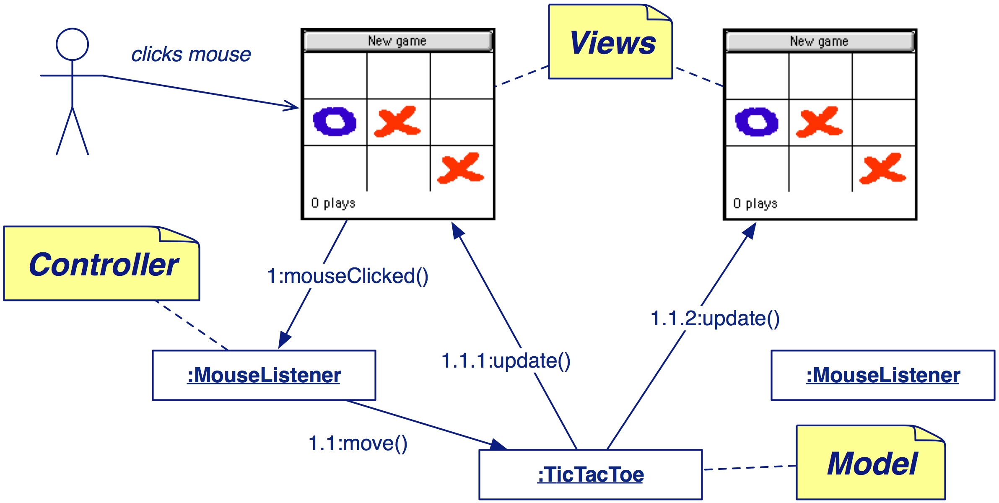

# P2 -- Object-Oriented Design

This repo contains the lecture material for the MSc level course “P2 -- Object-Oriented Design”.

This Bachelor course provides an introduction to object-oriented design in Java with an emphasis on practical techniques for developing complex software systems.

## Learning Outcomes

You will learn:

- how to apply Responsibility-Driven Design to decompose a complex system into objects
- how to use Design by Contract to develop robust software
- how to make use of inheritance to design flexible and generic software systems
- how to apply iterative and incremental development and continuous refactoring to arrive at a clean and understandable design
- how to effectively test software
- how to develop maintainable code by consistently applying simple design principles
- how to apply design patterns to simplify your software
- how to develop software that communicates its own design
- how to effectively use development tools like debuggers, version control systems, and integrated development environments?

## Slides

The slides have been prepared with Apple Keynote. Interspersed with the slideware are hidden slides containing notes for students. PDF versions of the slides can be found [here](http://scg.unibe.ch/download/lectures/p2/).

The figures for the slides have mostly been prepared using [OmniGraffle](https://www.omnigroup.com/omnigraffle/).

## Repo

This repo lives on [github](https://github.com/onierstrasz/course-p2-oo-design).
Further resources can be found on the [course web site](http://scg.unibe.ch/teaching/p2).

This work is licensed under a [Creative Commons Attribution-ShareAlike 4.0 International License](http://creativecommons.org/licenses/by-sa/4.0/).

---
